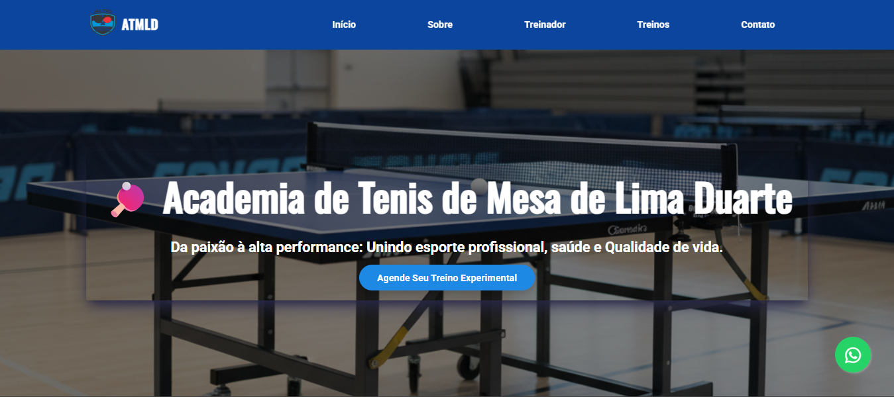

ATMLD | Academia de Tênis de Mesa de Lima Duarte
📸 Preview do Projeto

WebSite  da Academia de Tênis de Mesa de Lima Duarte (ATMLD), desenvolvida para divulgar os treinos, serviços e missão da academia, com foco em profissionalização, saúde e qualidade de vida por meio da prática do esporte.
___

🎯 Objetivo do Projeto

Este projeto foi criado para oferecer uma presença digital institucional ao centro de treinamento de tênis de mesa da cidade de Lima Duarte (MG), facilitando:

Visualização de informações da academia

Apresentação do treinador principal

Divulgação dos tipos de treinos

Acesso direto para contato via WhatsApp

Primeira impressão profissional online da academia

O site é um projeto estático com foco em comunicação visual e clareza das informações.
___

🚀 Tecnologias Utilizadas

HTML5 — Estrutura semântica

CSS3 — Estilização básica

Font Awesome — Ícones visuais

Hospedagem no GitHub Pages

Sem back-end, sem banco de dados

Acesse o Projeto   :  https://diogo-netto.github.io/lima-duarte-tenis-de-mesa/
